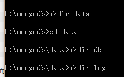

# mongodb-windows安装

1、[MongoDB官网下载](https://www.mongodb.com/download-center#community)</br>
2、安装选择custom自定义安装目录</br>
3、不要勾选mongodb compass（没什么卵用，选中安装会很慢，卡了大半个小时直接杀进程了）</br>
4、不选mongodb compass秒装完成,执行下图命令创建文件夹data,和子文件夹db,log(命令行不熟的可以直接右键创建文件夹)</br>
  <br/>
5、目录结构如下图, </br>
  <br/>
6、data目录同级创建mongodb.config配置文件，添加配置<br/>
   ```
   #数据库路径  注意此路径一定要改成你安装data下的db文件夹的路径
   dbpath=E:\mongodb\data\db
   #日志输出文件路径  注意此路径一定要改成你安装mongo.log文件夹的路径
   logpath=E:\mongodb\data\log\log.txt
   ```
7、创建配置和MongoDB服务<br/>
  ```
   mongod --config "E:\mongodb\mongodb.config" --install --serviceName "MongoDB"
  ```
8、启动服务
  ```
  net start MongoDB
  ```
9、停止服务
   ```
   net stop MongoDB
   ```
