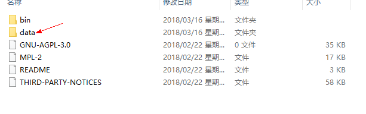

# mongodb-windows安装

1、<a target="_blank" href="https://www.mongodb.com/download-center#community">MongoDB官网下载</a> 
2、安装选择custom自定义安装目录 
3、不要勾选mongodb compass（没什么卵用，选中安装会很慢，卡了大半个小时直接杀进程了） 
4、不选mongodb compass秒装完成,执行下图命令创建文件夹data,和子文件夹db,log(命令行不熟的可以直接右键创建文件夹) 
   
5、目录结构如下图,  
   
6、
